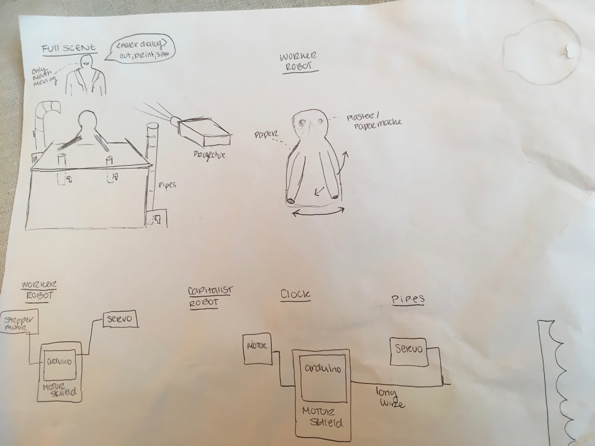

Final Project

# Project Reflections

## Concept 
The performance was meant to capture the aura of the tension between powerful elite and the working class, particularly in the current time as it feels like this gap is widening. To do this, we used a combination of sound, movement and visuals to create a rising tension and sense of anxiety and unease. The performance was inspired by Charlie Chaplin in [Modern Times](https://www.youtube.com/watch?v=DfGs2Y5WJ14) and we wanted to create a similar feel of industrial chaos with our robot. 

There were two actors, the worker and the boss. The worker was stamping out postcards on a conveyor belt as long period of time were passing on the clock. As the performance went on, there was heightened tension, anxiety and exhaustion of the worker robot until finally at the end the workers rise up and kill the boss.
We made the worker robot purposely simple and feeble and helpless. The boss was elevated and faceless, giving the image of undisputable power.

## Materials 
The materials used in the construction of the robot were quite varied, as at each stage of the process there were many prototypes and experiments of different materials. I was primarily responsible for the design and creation of the conveyor belt. This was a table with a rotating cloth and and a clock. I built the table supports out of wood planks and screwed them together along with a thick block in the corners to create a stable base. The surface of the table was made with acrylic (as opposed to wood) because we tried both materials and the wood had too much friction for it to allow the belt to glide, particularly with any weight on top of it.  I laser cut two holes in this piece to allow for the rollers. This took some trial and error in determining the height of the rollers and how large the hole should be. The rollers were made out of foam pool noodles, as this was a light material that wouldn’t weigh down the motor too much, but also was (nearly) perfectly round and the right diameter. I found the pool noodle did not have enough friction so I used strips of sandpaper to help pull the belt and pinned these into the noodle. I attached the noodle to the motor using laser cut wood circles with holes for the motor. I used 
To complete the project, I had to learn a lot of mechanical engineering and building techniques. I learned these primarily by trial and error. I also became a pro using the laser cutter.

## Electrical 
The electrical component of the project consisted of running the DC motors for the conveyor belt. I kept these at a constant speed. I also created a clock to go along with it. This motor was a programmed with a basic spinning pattern in a clockwise direction. It was programmed to speed up throughout the performance, however the change in speed was not very noticeable.

## Mechanical 
The mechanical aspect of the conveyor belt was more complex. I detailed them primarily in the materials section.

## Challenges
The main challenge I faced was making the two rollers of the conveyor belt parallel. Additionally, I made the top surface of the conveyor belt acrylic, which proved more difficult to work with than I imagined, in terms of screwing other elements into the board. Finally, Creating rollers that adequately pulled the conveyor belt without getting stuck from too much friction, and not being too smooth, was a challenge. In the end I cut strips of sandpaper to wrap around a pool noodle and this worked well. Attaching anything to the pool noodle was also a challenge because glue or screws would just rip out.

## Final Version

# Detailed plan for actor

#### Areas of greatest risk or uncertainty
Risk: Creating smooth transitions and motions of actors
Uncertainity: story line

#### Mechanical
There will be a play or story that culminates in the death of an actor.
Necessary for performance
- create sustainable actors, ensure they wont fall apart
- pushing a button with a robotic arm

#### Electronics
We will create three main robot actors, one be a head on the wall head:
- 3 Arduino uno
- printed PCB board to clean up electronics
- switch for actor
- light sensor
- Adafruit bluetooth module
- large button

#### Software
- program motions and actions into actor
- integrate speech element into actor

#### Power
The actors will have batteries will attatched, and these should be able to last the durration of the performance.

#### Parts list
The scenes will need to be designed and fabricated:
- wood
- possibly paint?

#### Organizational
Use readme for updates, wiki for project documentation

#### Inspiration
https://www.youtube.com/watch?v=xzHz484y9hI
https://www.youtube.com/watch?v=AiFGATFzgfU
https://www.youtube.com/watch?v=y8D8mHF1Jqw

## Discussion with Michael
LED to signify dying?
Servos
think about degrees of freedom

## Final Project Schedule
###### Tuesday November 14 9-10:15 AM
- create 3 prototypes
###### Thursday November 16 9-11:40 AM
- work on 3 prototypes
###### Tuesday November 21 9-10:15 AM
- finish 3 prototypes
- brainstorm 3 story lines
- look deeply into famous plays and pupppets
###### Thursday November 23 9-11:40 AM
- settle on a prototype
- create a prototype 2.0
###### Saturday November 25 9-11:40 AM
- create the scene
- program Actors
###### Tuesday November 28 9-10:15 AM
- final touches on scene and actors
###### Thursday December 7 9-11:40 AM -  Team presentation: Tech rehearsal
###### Tuesday December 12 9-10:15 AM - Team presentation: Dress rehearsal
###### Wednesday December 13 5:30-7:30 PM - FINAL SHOW

## Nov 21 Update

##### Project description to date: 
We have decdied to pursue a "Charlie Chaplin Modern times" esq scene with one robot as the "proliteriate" robot that is on the assembly line as a worker and another "capitalist" boss that is telling the robot what to do faster and faster until the robot starts to fall apart and almost die. Then the audience is given the option to kill the boss robot, and the manaquin on the wall forcing the robot to work dies.

##### Greatest risk or uncertainty
The robot actions will be the hardest part. We have to figure out how to lift a stamp and stamp the stamp.

##### Detailed parts list
###### "Worker" Robot
- Paper body, possibly also made with cloth
- Paper maché / plaster face
- Step motor for turning body (need stronger motors)
- Step motor lifting arm (need stronger motors)
- Motor shield
- 1 arduino uno (Arduino will handle both motors, fine because the delays will be at appropriate times. As the motor lifts the hand up, the other motor will be still and visa versa)
- Bluetooth module (for manual override)
- String/wire to pull the hand up

###### "Capitalist" Robot
- Manaquin body
- Cloth head

###### Background pipes
- Black paper
- Cardboard
- Step/Servo Motor
- Arduino

###### Clock
- White paper
- Black plastic/paper for clock hands
- Arduino (could potentially share with background pipes)

##### Electronic and electromechanical items not figured out
- How to lift the arm

##### Hand drawn sketch & Block diagram of the electronics

##### Outline of programs
###### "Worker" Robot
1. lift stamp
2. turn right 35 degrees 
3. put stamp in ink
4. lift stamp
5. turn left 70 degrees 
6. stamp
7. turn right 70 degrees

###### "Capitalist" Robot
No robotic movements (only speaking and projection)

###### Background pipes
1. move forward/ upwards
2. delay
3. move backwards/downwards
4. delay

###### Clock
1. start motor
2. move forward
3. with manual commands (bluetooth), move faster

##### Interactive Element
For our performance, we will ask the audience to decide if we should kill the "capitalist" robot or not. This will be in the form of a website. The audience input will not actually decide the fate of the robot, but rather it will be a tool to engage the audience and make them think hard about the direction the play should proceed in. 

