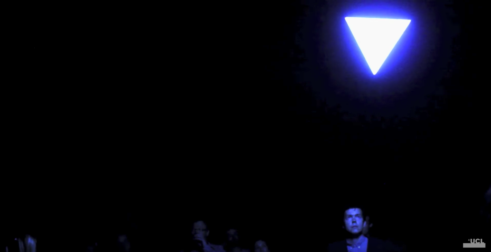

#Performing Robots

##Robotic Performance
Glowing tetrahedron suspended in space within a concrete chamber. A performance of the audience and the space interacting through light robotics. The robots respond to the audience through sensors and seek to engage the audience through childlike curiosity. This performance by Ruairi Glynn took place at the Tate Modern.
https://www.youtube.com/watch?v=TEq3oczAt7o

