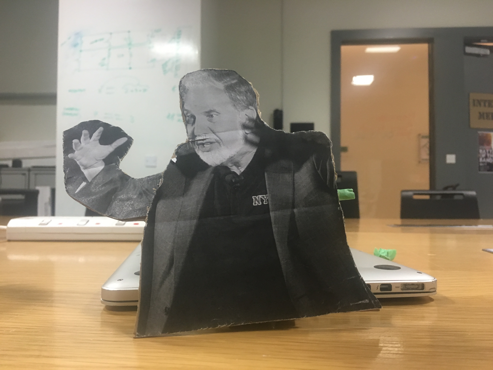
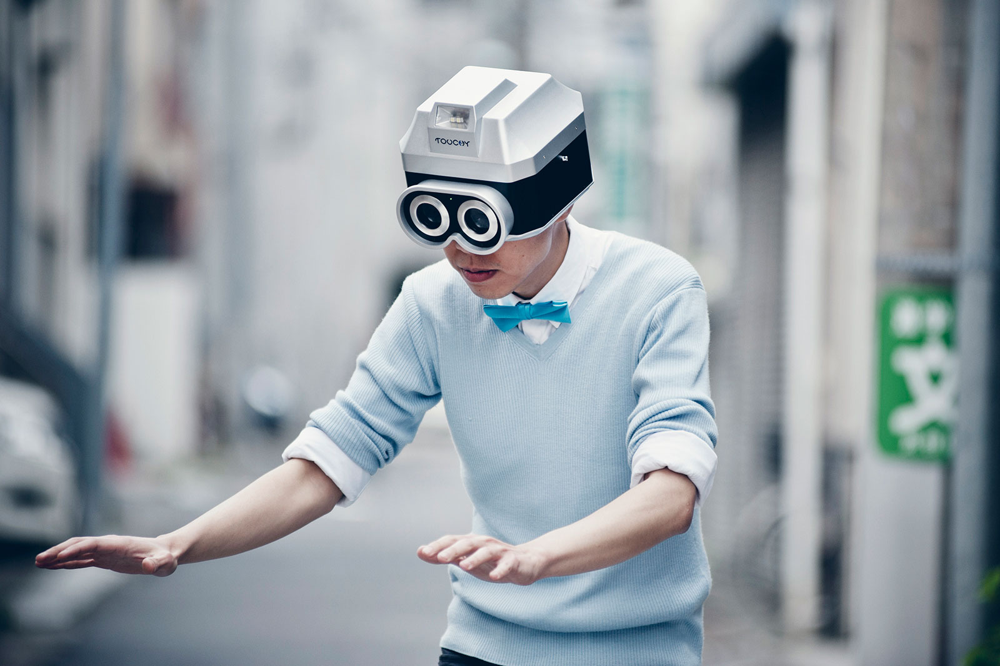
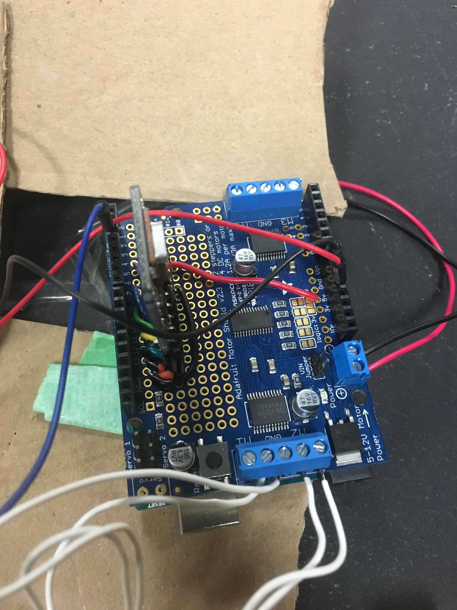
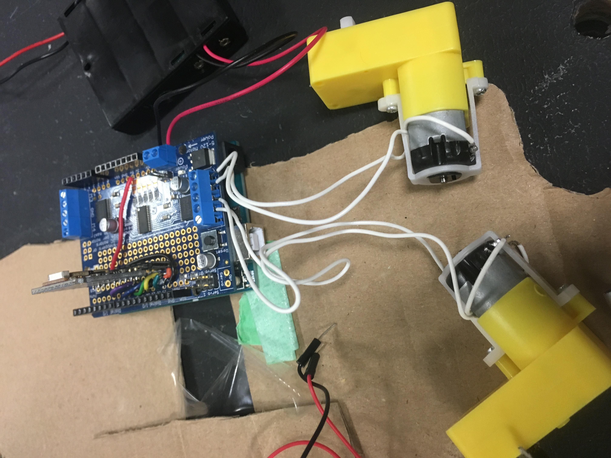
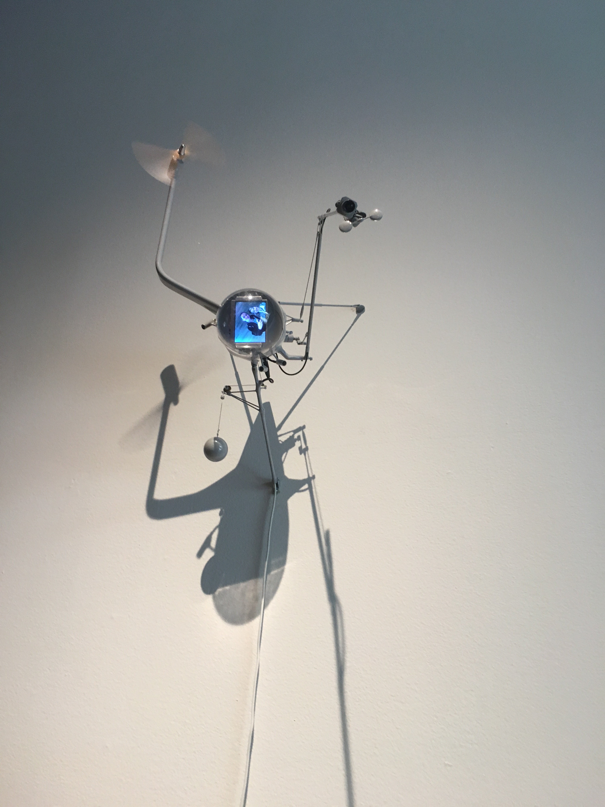
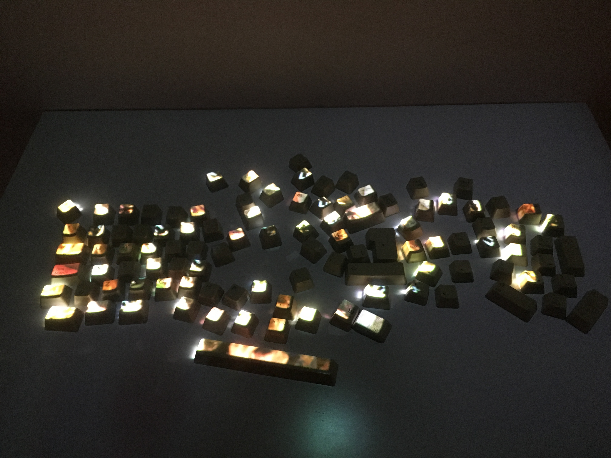

# Performing Robots

## Robotic Performance
Glowing tetrahedron suspended in space within a concrete chamber. A performance of the audience and the space interacting through light robotics. The robots respond to the audience through sensors and seek to engage the audience through childlike curiosity. This performance by Ruairi Glynn took place at the Tate Modern.
https://www.youtube.com/watch?v=TEq3oczAt7o

## Update on Robot

## Response to Today’s Disussion
Some interesting tidbits...

[Isaac Asimov's "Three Laws of Robotics"](https://www.auburn.edu/~vestmon/robotics.html)
1. A robot may not injure a human being or, through inaction, allow a human being to come to harm.
2. A robot must obey orders given it by human beings except where such orders would conflict with the First Law.
3. A robot must protect its own existence as long as such protection does not conflict with the First or Second Law.

[Guiness World Record Dancing Robots](https://qz.com/1061372/watch-1069-robots-dance-their-way-to-a-guinness-world-record/)

Maybe our class should make the world record in Abu Dhabi ;)

## Interesting Artist : Eric Siu

[Eric Siu](http://ericsiu.net/) has done some really interesting work in the space of new media robticesque art.
The project above is called touchy. "Touchy is a human camera – a wearable device that literally transforms a human being into a functioning camera. The wearer is constantly “blinded” unless someone touches his/her skin that causes the shutters to open and restores the wearer’s vision. When physical contact is held for 10 seconds, the camera takes a “Touch-Snap”, which is displayed on the device’s LCD."

## Some thoughts on cybernetics
[Claude Shannon](https://www.youtube.com/watch?v=z2Whj_nL-x8)

As we start out in the this class discussing cybernetics, I think it is interesting to go back to one of the original people who started it all in the world of communication.

## Bluetooth Module Update

Putting together the bluetooth module..

## Orlando

While in Orlando, I went to OMART, Orlando Museum of Modern Art. The exhibition was a very cool new media exhibition.

## Idea for final project

## Fritz
#### Things that could have been better

## Detailed plan for actor

#### Areas of greatest risk or uncertainty
Creating smooth transitions and motions of actors

#### Mechanical
- 
#### Electronics
We will create two main robot actors, one that will inteact with the head:
- 2 Arduino uno
- printed PCB board to clean up electronics

#### Software
- program motions and actions into actor
- integrate speech element into actor

#### Power
The actors will have batteries will attatched, and these should be able to last the durration of the performance.

#### Parts list
The scenes will need to be designed and fabricated:
- wood
- possibly paint?

#### Schedule
Tuesday November 14 9-10:15 AM
- create 3 prototypes
Thursday November 16 9-11:40 AM
- settle on a prototype
Tuesday November 21 9-10:15 AM
Thursday November 23 9-11:40 AM
Saturday November 25 9-11:40 AM
Tuesday November 28 9-10:15 AM
Thursday December 7 9-11:40 AM -  Team presentation: Tech rehearsal
Tuesday December 12 9-10:15 AM - Team presentation: Dress rehearsal
Wednesday December 13 5:30-7:30 PM - FINAL SHOR
